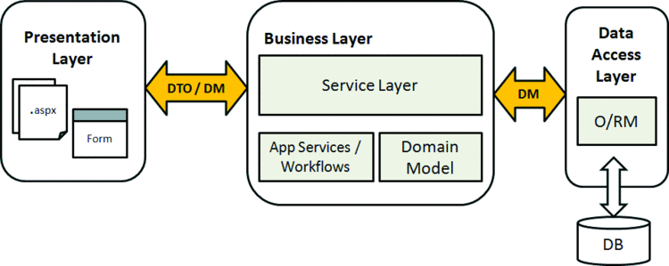
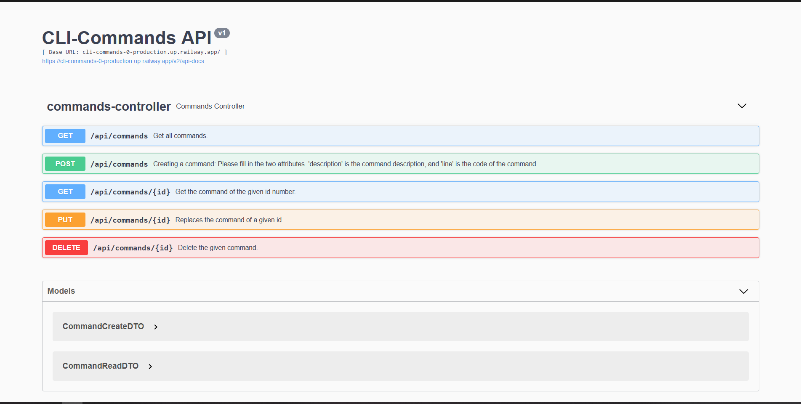

# CLI Commands REST API (Java Spring Boot)
Site link: https://cli-commands-0-production.up.railway.app/swagger-ui/index.html /commands-controller

#### With the plethora of CLI commands to learn, it is helpful to have an API which returns us commands that we often forget. This Commands API stores command line snippets along with a short description of what it does.
### The purpose of this project is to learn and practice concepts related to:
> - Java Spring Boot
> - Building a REST API
> - 3-Tier Architectural Pattern
> - Containerizing applications using Docker

#### More specifically, I used the following:
> - Dependency injection
> - Repository design pattern
> - PostgreSQL and Spring Data JPA
> - Data Transfer Objects (DTOs)
> - RESTful API guidelines
> - HTTP (GET, POST, PUT, DELETE, status codes)
> - Testing API Endpoints (SwaggerUI & Postman)
> - Unit testing (Mockito & AssertJ)
> - Docker (Multi-Container Application)
> - Railway (Deployment: Github repo + SQL database)

 
### Application Architecture:

 

 
### Website Look:

